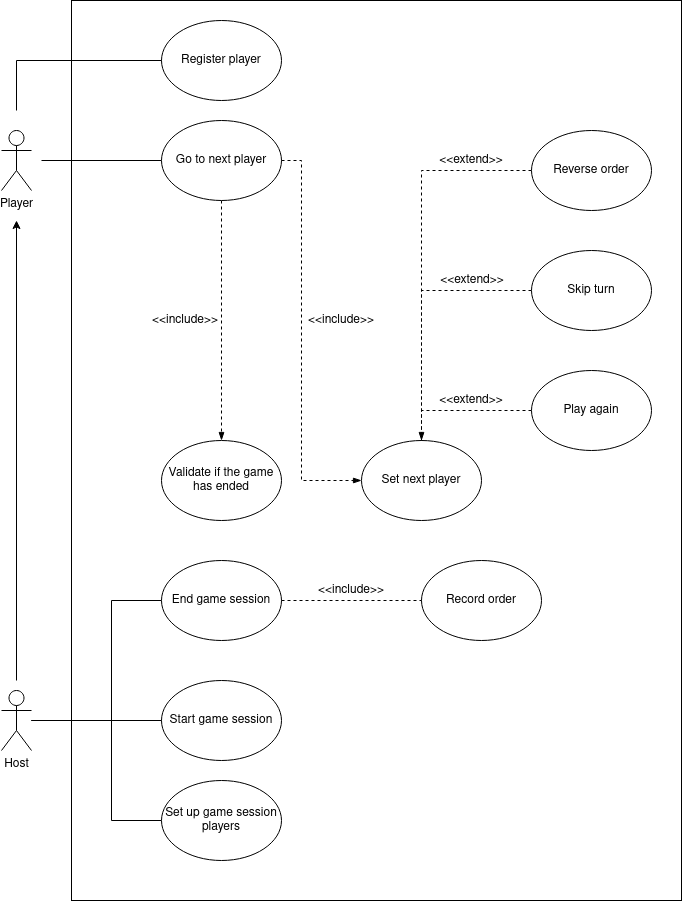

# Turn Tracker the Board Game Association system

This project aims to create an app to keep track of whose turn it is in a multi-player board game. After a player takes his/her turn, the player should be located at the end of the list, while the turn advances to the next player in the list. 

## Functional requirements

The Board Game Association needs a new system to keep track of whose turn it is in every board game session hosted by its associates. 
- It wants to have all playes registered, even the non associates. It only requires the name and age of a player. 
- It wants to keep track of the participants of each board game played, and who is the host. The host must be an associate of the Board Game Association. 
- It wants to define the players order before the game start.
- It wants to keep track of who is the next player.
- It wants to skip a turn of a player when required.
- It wants to allow play again when required.
- It wants to reverse the players order.
- It wants to keep the record of the session players order.

### Use cases

Main user case diagram

## Non functional requirenments

Create an app in python to listen for requests. 
Create POST method on `/players` to allow participant's list creation with their names.
After the player takes his/her turn, he/she should be sent to the end of the queue. The next player to be shown is the next on the list.
Create GET method on `/players/next` to end turn and display the name of the next player.
Create GET method on `/players` to display the current status of the circular list.
Create DELETE method on `/players` to delete the current players list.

